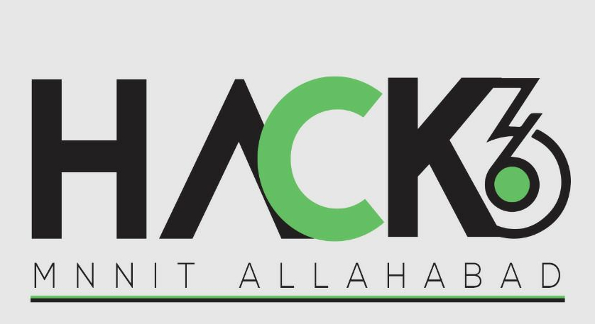

# hack36mnnit.github.io [](http://makeapullrequest.com)

Hack 36 is the first edition of Hackathon at MNNIT Allahabad being organised under the aegis of Computer Science and Engineering Department. It will bring together budding hackers and developers for a feast of thirty-six continuous hours. The participants will code solutions to the real-life problems.

## Contributing
Feel free to send a pull request.

## How to run the website
```bash
git clone https://github.com/hack36mnnit/hack36mnnit.github.io
cd hack36mnnit.github.io
python2 -m SimpleHTTPServer
```

Now browse to http://localhost:8000
